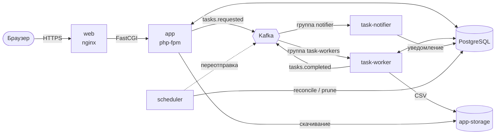
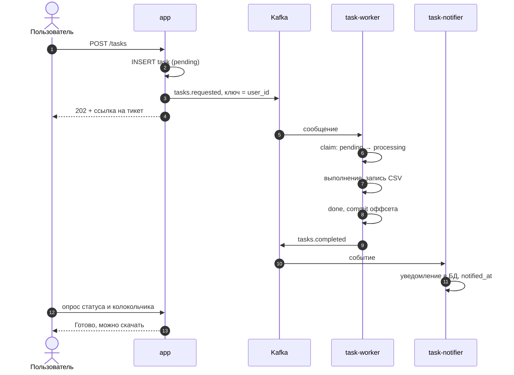
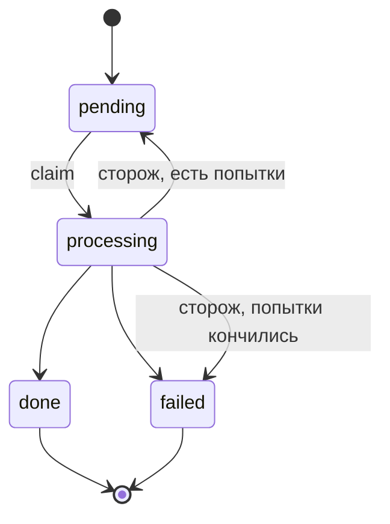
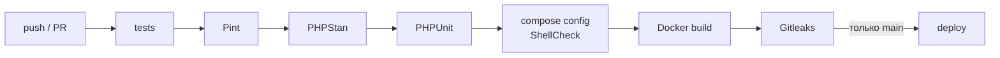

<div align="center">

# 🎣 Silver Udochki

**Веб-приложение для рыболовов: каталог, личный кабинет, панель управления
с гибкой системой ролей и фоновая обработка тяжёлых задач через Apache Kafka.**

[](https://github.com/byterID/Silver-Udochki/actions/workflows/ci.yml)


[Сайт](https://silver-udochki.ru) · [Архитектура](#-архитектура) · [Быстрый старт](#-быстрый-старт) · [Фоновые задачи](#-фоновые-задачи) · [Деплой](#-cicd-и-деплой)

</div>

---

## ✨ Возможности

- **Каталог и корзина** — витрина товаров «Лавка».
- **Роли и права** — панель управления на `spatie/laravel-permission`, группы действий, гибкая выдача доступа.
- **Фоновые задачи** — тяжёлый запрос не держит пользователя на странице: сервер сразу выдаёт тикет, а работу выполняет воркер.
- **Живой статус** — страница задачи обновляется сама и показывает «В очереди → Выполняется → Готово».
- **Уведомления** — колокольчик в шапке загорается, когда задача завершена, на любой странице сайта.
- **Скачивание результата** — CSV-журнал выполнения хранится 5 минут, на странице идёт обратный отсчёт.
- **Отказоустойчивость** — сторож находит потерянные и зависшие задачи и возвращает их в работу.
- **Диагностика** — страница, показывающая, как запрос дошёл до сервера.

## 🧰 Стек

| Слой | Технологии |
|---|---|
| Бэкенд | PHP 8.4 (FPM), Laravel 13, spatie/laravel-permission |
| Фронтенд | Blade, Tailwind CSS, Alpine.js, Vite |
| Данные | PostgreSQL 17 |
| Очередь событий | Apache Kafka 4.1 (KRaft, без ZooKeeper), `mateusjunges/laravel-kafka` + `ext-rdkafka` |
| Инфраструктура | Docker Compose, nginx, Certbot, Ansible, Tailscale |
| Мониторинг | Prometheus, Grafana, node-exporter, cAdvisor, postgres-exporter, nginx-exporter |
| Качество | Pint, PHPStan (Larastan), PHPUnit, ShellCheck, Gitleaks, GitHub Actions |

## 🏗 Архитектура



Kafka используется как **шина событий**: веб-приложение не знает, кто и как обработает задачу.
Каждый потребитель читает топик в своей consumer group, поэтому новых подписчиков
(письма, аналитика) можно добавлять, не трогая существующий код.

### Сервисы

| Сервис | Назначение | Пользователь |
|---|---|---|
| `web` | nginx, TLS, статика, проксирование в php-fpm | — |
| `app` | Laravel, обработка HTTP-запросов | `www-data` |
| `db` | PostgreSQL 17 | `postgres` |
| `kafka` | брокер и контроллер в одном узле (KRaft), heap 256 МБ, `mem_limit: 700m` | — |
| `kafka-init` | разово выставляет права на volume `kafka-data` и завершается | root |
| `task-worker` | `tasks:consume` — выполняет задачи | `www-data` |
| `task-notifier` | `tasks:notify` — создаёт уведомления | `www-data` |
| `scheduler` | `schedule:work` — сторож и очистка результатов | `www-data` |

Экспортеры мониторинга вынесены в `docker-compose.monitoring.yml` и слушают только Tailscale-адрес.

> 🔒 У Kafka нет секции `ports:` — брокер доступен только внутри docker-сети.
> Аутентификации у неё нет, поэтому публиковать порт наружу нельзя.

## 🚀 Быстрый старт

Нужны Docker и Docker Compose v2.

```bash
git clone https://github.com/byterID/Silver-Udochki.git
cd Silver-Udochki
cp .env.example .env
```

Заполните в `.env` как минимум `DB_PASSWORD`, `ADMIN_EMAIL`, `ADMIN_PASSWORD`. Затем сгенерируйте ключ
и вставьте его в `APP_KEY=`. `.env` примонтирован в контейнер только для чтения, поэтому ключ
выводится на экран, а не записывается в файл:

```bash
docker compose run --rm --no-deps app php artisan key:generate --show
```

Запуск:

```bash
docker compose up -d --build
sh docker/kafka/create-topics.sh          # на Windows — из Git Bash или WSL
docker compose exec app php artisan migrate --seed
```

Сайт откроется на `http://127.0.0.1:8080`.

<details>
<summary><b>Проверить, что пайплайн работает</b></summary>

```bash
docker compose exec app php artisan tasks:demo --seconds=5
docker compose logs -f task-worker task-notifier
```

Через несколько секунд задача станет «Готово», а в колокольчике появится уведомление.

</details>

## ⚙️ Фоновые задачи

### Путь задачи



### Топики

| Топик | Партиции | Ключ | Кто пишет → кто читает |
|---|---|---|---|
| `tasks.requested` | 3 | `user_id` | app, scheduler → task-worker |
| `tasks.completed` | 1 | `user_id` | task-worker, scheduler → task-notifier |
| `tasks.requested.dlq` | 1 | — | сообщения, которые не удалось разобрать |

Ключ `user_id` гарантирует, что задачи одного пользователя выполняются по очереди, а задачи
разных пользователей — параллельно. Воркеров больше, чем партиций (3), запускать бессмысленно.

### Статусы



### Гарантии доставки

- **At-least-once.** Оффсет коммитится только после обработки, поэтому при падении воркера сообщение придёт снова.
- **Идемпотентность.** `claim()` — атомарный `UPDATE ... WHERE status = 'pending'`, повторное сообщение просто пропускается.
- **Сторож (`tasks:reconcile`, раз в минуту)** переотправляет задачи, не дошедшие до Kafka (`published_at IS NULL`),
  возвращает зависшие в `processing` и догоняет неотправленные события о завершении.
- **Graceful shutdown.** На SIGTERM воркер доделывает текущую задачу (`stop_grace_period: 90s`).
- **Очистка (`tasks:prune-results`, раз в минуту)** удаляет файлы результатов через 5 минут после завершения.

### Artisan-команды

| Команда | Что делает |
|---|---|
| `tasks:consume` | воркер задач (запущен в `task-worker`) |
| `tasks:notify` | нотификатор (запущен в `task-notifier`) |
| `tasks:reconcile` | сторож потерянных и зависших задач |
| `tasks:prune-results` | удаление просроченных файлов |
| `tasks:demo --seconds=5 --count=1 --user=` | создать демо-задачи для отладки |

### Переменные окружения

| Переменная | По умолчанию | Описание |
|---|---|---|
| `KAFKA_BROKERS` | `kafka:9092` | адрес брокера внутри docker-сети |
| `KAFKA_OFFSET_RESET` | `earliest` | откуда читать новой consumer group |
| `TASKS_STALE_AFTER_MINUTES` | `10` | через сколько задача в `processing` считается зависшей |
| `TASKS_RESULT_TTL_MINUTES` | `5` | сколько хранится файл результата |
| `COMPOSE_FILE` | — | на сервере: `docker-compose.yml:docker-compose.monitoring.yml` |

## 🔍 Отладка Kafka

```bash
# список топиков
docker compose exec kafka /opt/kafka/bin/kafka-topics.sh --bootstrap-server localhost:9092 --list

# оффсеты и отставание группы воркеров
docker compose exec kafka /opt/kafka/bin/kafka-consumer-groups.sh \
  --bootstrap-server localhost:9092 --describe --group task-workers

# два воркера — увидеть ребаланс партиций
docker compose up -d --scale task-worker=2
```

В выводе `--describe` колонка `LAG` показывает, сколько сообщений ещё не обработано.
Ноль — воркеры успевают.

## 📊 Мониторинг

Prometheus и Grafana работают на отдельной машине и снимают метрики с сервера по Tailscale.

| Экспортер | Порт | Что показывает |
|---|---|---|
| node-exporter | 9100 | CPU, память, диск, сеть хоста |
| cAdvisor | 8080 | ресурсы каждого контейнера |
| postgres-exporter | 9187 | соединения, транзакции, размер БД |
| nginx-exporter | 9113 | запросы и соединения nginx |

Ориентировочное потребление памяти всего стека — **1–1,3 ГБ**, поэтому на сервере с 2 ГБ RAM включён swap.

## 🔄 CI/CD и деплой



Деплой при push в `main` по SSH:

1. `git merge --ff-only origin/main`
2. бэкап базы (хранится 14 дней)
3. `docker compose build` — сайт пока работает на старом коде
4. `up -d db kafka` и создание топиков
5. миграции в разовом контейнере из нового образа
6. `up -d --remove-orphans` — перезапуск на новом коде
7. проверка, что ни один контейнер не ушёл в рестарт-цикл, и smoke-check сайта

Миграции пишутся обратно совместимыми (только новые таблицы и nullable-колонки),
поэтому их можно выполнять, пока работает старая версия.

Сервер настраивается Ansible-плейбуком (`server.yml`): Docker, ufw, Tailscale,
swap, SSH-ключи и шаблон `.env` с правами `0640` для группы `www-data` (gid 82).

## 🧯 Частые проблемы

<details>
<summary><code>Class "..." not found</code> после изменения кода</summary>

Код запечён в образ. После любых изменений PHP, `composer.json` или `config/`
нужна пересборка: `docker compose up -d --build`. Исключение — `.env`, хватит перезапуска.

</details>

<details>
<summary>Скачивание результата отдаёт 410</summary>

Либо истёк срок хранения (5 минут), либо у `task-worker` нет общего volume `app-storage`
или он запущен не от `www-data`. Проверка от имени веб-процесса:
`docker compose exec -u www-data app ls storage/app/private/results`.

</details>

<details>
<summary>Kafka падает с <code>AccessDeniedException</code></summary>

Нет прав на volume `kafka-data`. Их выставляет `kafka-init` — проверьте, что он
завершился успешно: `docker compose ps -a kafka-init`.

</details>

<details>
<summary>В логах воркера <code>Name does not resolve</code> или <code>Connection refused</code></summary>

Kafka перезапускается или ещё загружается. librdkafka переподключается сам —
если ошибки прекратились, всё в порядке.

</details>

---

<div align="center">
<sub>Pet-проект для изучения инфраструктуры современных веб-систем 🐟</sub>
</div>
